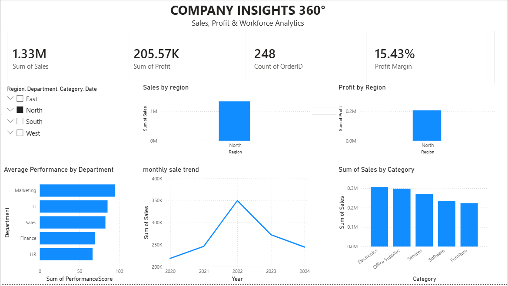
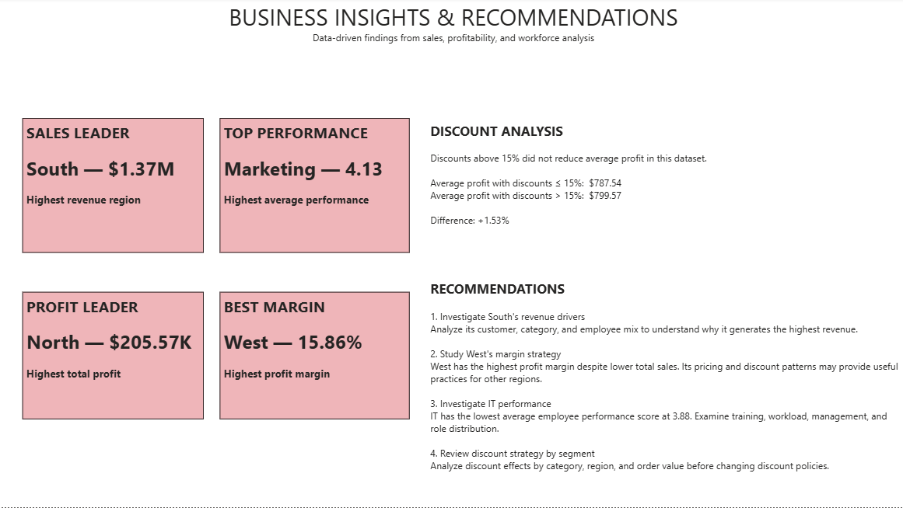

# Company Insights 360° — Business Analytics Dashboard

An end-to-end business analytics project combining Python, SQL, and Power BI to analyze sales performance, profitability, regional trends, and employee performance.

## Project Overview

This project follows a complete data analytics workflow:

1. Data collection and preparation
2. Exploratory Data Analysis using Python
3. SQL-based business analysis
4. Data modeling
5. Interactive Power BI dashboard development
6. Business insights and recommendations

## Dataset

The project uses three datasets:

- Sales — 1,000 orders
- Employees — 100 employees
- Departments — 5 departments

### Sales Data

The sales dataset contains:

- Order ID
- Employee ID
- Customer Name
- Region
- Category
- Sales
- Profit
- Discount
- Date

### Employee Data

The employee dataset contains:

- Employee ID
- Name
- Department
- Role
- City
- Gender
- Salary
- Hire Date
- Performance Score
- Manager ID
- Experience

## Technology Stack

- Python
- Pandas
- Matplotlib
- SQLite
- SQL
- Power BI
- DAX
- Git & GitHub

## Key KPIs

| KPI | Value |
|---|---:|
| Total Sales | $5.17M |
| Total Profit | $790.02K |
| Total Orders | 1,000 |
| Profit Margin | 15.27% |
| Average Discount | 9.93% |

## Key Business Insights

### Regional Performance

South generated the highest revenue at approximately $1.37M.

North generated the highest total profit at approximately $205.57K.

West achieved the highest profit margin at approximately 15.86%.

### Category Performance

Software was the highest-performing category by sales, generating approximately $1.21M.

Furniture generated the lowest sales at approximately $849K.

### Employee Performance

Marketing recorded the highest average employee performance score at 4.13.

IT recorded the lowest average performance score at 3.88.

### Discount Analysis

The data does not support the assumption that discounts above 15% reduce profit.

Average profit:

- Discount ≤ 15%: $787.54
- Discount > 15%: $799.57

The difference is approximately +1.53%.

This indicates that further analysis by region, category, and order value would be required before changing discount policies.

## Power BI Dashboard

The Power BI report contains:

- Executive KPI dashboard
- Sales by Region
- Sales by Category
- Profit by Region
- Monthly Sales Trend
- Average Employee Performance
- Discount vs Profit
- Interactive Region, Category, Department, and Date filters
- Business Insights and Recommendations

## Project Structure

```text
Company-Insights-360/
│
├── data/
│   ├── sales.xls
│   ├── employees.xls
│   └── departments.xls
│
├── python/
│   ├── analysis.py
│   └── eda.py
│
├── SQL/
│   ├── database.py
│   ├── run_queries.py
│   └── company_insights.db
│
├── outputs/
│   ├── department_performance.png
│   ├── discount_vs_profit.png
│   ├── monthly_sales.png
│   ├── profit_by_region.png
│   ├── sales_by_category.png
│   └── sales_by_region.png
│
├── Company_Insights_360.pbix
├── requirements.txt
├── README.md
└── .gitignore
## Dashboard Preview

### Executive Dashboard



### Business Insights

